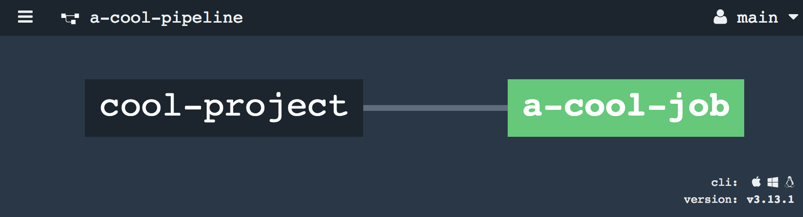
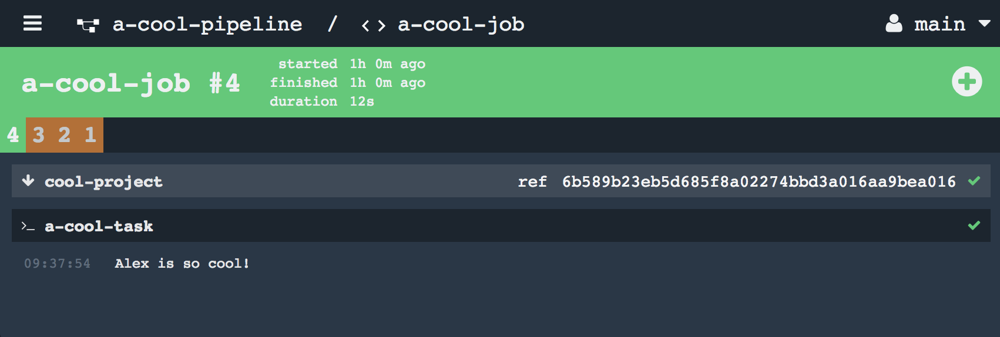
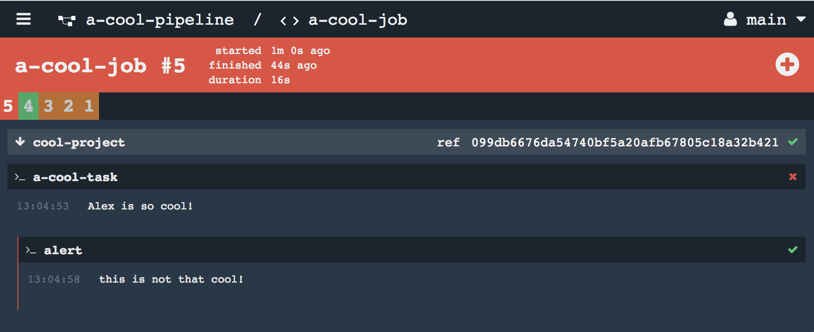

# Why we are here

If you are reading this blog, you probably already know the benefits of Continuous Integration and Continuous Delivery and Concourse is one of the great options out there. You may not know where and how to start this new DevOps journey. This blog will try to elimiate your concerns through the following Chapters.

# Chapter 1
## What is Concourse

Concourse was started as a side-project inside Pivotal. It became very popular quickly in the CloudFoudnry Community and Pivotal and now in the DevOps world, because it has benifits like a yml defined pipeline, containerized environment, well defined API for supporting different resources, etc.

## Why Concourse
Let's talk about some of the benefits a little.

The pipeline in Concourse is defined only by one `yml` file so that it can be placed into the project repostiory and can be tracked by VCS. In this case, the pipeline would always be alined with the code and tests. It's also a good chance to put Dev and Ops sitting together.

Having containerized environments for different tests makes sure there is no pollution between tests and testing environments. And users have control over what docker images are used in each test and those Dockerfiles could also be tracked. If things go wrong during the tests, the user can inject into the failing contianer and perform debugging.

Concourse supports a reasonably large amount of plugins for different abilities like building and pushing Docker images, sending Slack messages to the team if builds failed... You get the idea.

## How to deploy

You can always deploy Concourse using bosh if you are familiar with it. If not, don't worry, Concourse also provides deployment using [docker-compose](https://github.com/concourse/concourse-docker).

Once it's being deployed, we can download Concourse's CLI named `fly` from its home page, and put it into our `PATH`.

First we need to login using:
```
fly --target=cool login --concourse-url http://127.0.0.1:8080
```

This will create a yml file at `${HOME}/.flyrc` containing the following lines:
```
targets:
  cool:
    api: http://127.0.0.1:8080
    team: main
    token:
      type: Bearer
      value: THISISASUPERLONGFAKETOKENIFYOUAREREADINGTHISYOUAREAVERYCOOLDEVELOPER
```

In the above file, `cool` is an alias for this Concourse instance. Using this, we can use `fly` without typing IP and password everytime. For example, if Concourse is upgraded and we want to upgrade the local `fly`, we can use the following command:
```
fly -t cool sync
```

# Chapter 2
## Baby Crawl

A pipeline normally consists of many different tasks. Concourse is able to run a task in a container and react to its result. That's why a task could make the pipeline very colorful. A task is defined as a yml file. This file only defines what is needed to run this task, and doesn't specify how to get different dependencies into its running container.

For instance, lets say we have a project called `cool-project`, and this project needs to be run. This is done through a script; in this case, `a-cool-task`, which is placed in: `cool-project/ci/tasks/a-cool-task.sh`. This cool task is saying "I need to be running in a container from an Ubuntu image, and I'm expecting there to be a folder called `cool-project` placed into my working directory with the file `cool-project/ci/tasks/a-cool-task.sh` inside of it. Lastly, `A_VERY_COOL_ENV` is required for me to start".

<details><summary> a-cool-task.yml </summary>

```
platform: linux

image_resource:
  type: docker-image
  source:
    repository: ubuntu

inputs:
- name: cool-project

params:
  A_VERY_COOL_ENV:                          "replace-me"

run:
  path: cool-project/ci/tasks/a-cool-task.sh
```
</details>

Say we have this cool-project at `${HOME}/workspace/cool-project`, and our task definition file is colocated with the task script. We can run this task using the `fly` command like this:

```
A_VERY_COOL_ENV="sure" \
fly -t cool execute -c ${HOME}/workspace/cool-project/ci/tasks/a-cool-task.yml \
                    -i ${HOME}/workspace/cool-project/
```

The `execute` command will ask Concourse to run this task as oneoff, not being part of any pipeline. Concourse will create a new container from `ubuntu` and populate `A_VERY_COOL_ENV` into this container. It will also copy the whole `cool-project` folder into the working directory, denoted by `${WORK_DIR}` for now. Then, it will trigger `${WORK_DIR}/cool-project/ci/tasks/a-cool-task.sh` to start the task script.

Normally, `execute` will help us a lot during the development stage of the pipeline itself, because it provides a much faster feedback loop.

## Baby steps

Now, let's build a dummy pipeline and put it into `cool-project/ci/pipeline.yml`. We can put all pipeline related files into the `ci` folder.

<details><summary> pipeline.yml </summary>

```
jobs:
- name: a-cool-job
  plan:
  - get: cool-project
    trigger: true
  - task: a-cool-task
    file: cool-project/ci/tasks/a-cool-task.yml
    params:
      A_VERY_COOL_ENV:                    {{value_for_a_very_cool_env}}

resouces:
- name: cool-project
  type: git
  source:
    uri: git@fake-github:DellEMC/cool-project.git
    branch: master
    private_key: {{cool_project_github_private_key}}
```
</details>

A pipeline normally has two parts, `resources` and `jobs`. Resources are the definitions for dependencies like a git repository such as `cool-project`  or a Docker image, etc. Concourse is able to download those resources and put them into containers where the jobs are running.

Jobs are the core part of a pipeline, they define the whole workflow of the pipeline. For example, in the above pipeline, we only have one job `a-cool-job`, and it has two `step`s that will be running in sequence in the order writen in the job definition. The first step is a `get` that will download the `cool-project` repo, and it will be triggered by pushing a new commit. The second step is to run the previous task that we defined (`a-cool-task`).

The last part is the variables wrapped by double braces `{{}}`. Those variables will be evaluated when we setup the pipeline. The value of these varibles could be stored in a separate yml file that is not going to be put inside this repository, because this file normally contains some secrets like the following one:

<details><summary> secrets.yml </summary>

```
value_for_a_very_cool_env: "very cool env"
cool_project_github_private_key: |
  THISISA
  FAKE
  MULTILINE
  PRIVATEKEY`
```
</details>

We can setup the pipeline by:

```
fly -t cool set-pipeline -p cool-pipeline \
                         -c ${HOME}/workspace/cool-project/ci/pipeline.yml \
                         -l ${HOME}/workspace/secrets/secrets.yml
```

Now if we open our pipeline in a browser, it should look something like this:



Black boxes stand for resources, while colored boxes stand for jobs.

If we click this job box, we should see the latest build of it.




# Chapter 3
## Making trouble

With the pipeline, we could run into 2 different kinds of trouble: the commits failed the pipeline or the pipeline failed itself. Let talk about the first one first.

### Hooks
When the commits failed, our pipeline will make the job box red, and will not go any further. At this point, we probably want to do some damage control or "blame" the trouble maker (for example, send him/her a Slack message).

Concourse Hooks will enable us to trigger another script when the task itself has failed or succeeded.

For example, with the following job definition, if any step inside the plan fails, Concourse will run the task under the `on_failure` hook, which will alert `this is not that cool!` in this case. We can also do something when the job succedded with `on_success` or when the job aborted with `on_abort`.

```
jobs:
- name: a-cool-job
  plan:
  - get: cool-project
    trigger: true
  - task: a-cool-task
    file: cool-project/ci/tasks/a-cool-task.yml
    params:
      A_VERY_COOL_ENV:                    {{value_for_a_very_cool_env}}
      A_VERY_COOL_RETURN_CODE:            {{value_for_return_code}}
  on_failure:
    task: alert
    image_resource:
      type: docker-image
      source:
        repository: ubuntu
    config:
      platform: linux
      run:
        path: echo
        args: ['this is not that cool!']
```



### Hijack
With hooks, we are able to do some "damage control", but we still eventually need to know why it failed. We can hijack into the container that ran this particular task by:
```
fly -t cool hijack --job a-cool-job --build=5
```
Now we just need to select the number of the step where the job failed from the output.

Because Concourse has its own Garbage Collection system, it will remove inactive containers after a certain amount of time. We can actually set the interval of GC doing cleanup by adding the option `--gc-interval` to the start command of the Concourse web instance.

### One-off
Like what we did in [Baby Crawl](#baby-crawl), we can debug a task separately with the same inputs from the pipeline. The reason why we do this is because we can get much faster feedback if we are trying to fix it. For the same reason, we also use one-off a lot while we are developing a new task.

# Chapter 4
## Playdate
Concourse cannot do everything. As users, we still need to write some code to solve some problems ourselves. For example, we are not able to pass artifacts being built from one job to the next job.

However, Concourse provides a well defined [pattern](https://concourse-ci.org/implementing-resources.html) for developers to create plugins to allow Concourse to do things that it would not normally be able to do. For example, it has an s3 plugin which makes it easy for us to upload or download artifacts from Amazon S3 Storage to pass artifacts between jobs.

Sometimes, our test involves multiple stages, like: clean existing servers, deploy new servers, then run test. Once a commit goes into these stages, we want to make sure that no other commits go into these stages again until the first commit is finished since we only have limited resources to run servers. To prevent other commits from going into these stages, we can use the plugin [pool](https://github.com/concourse/pool-resource).

```
jobs:
- name: deploy-new-servers
  plan:
  - put: locks
    params:
      claim: a-cool-lock
  - task: clean-then-deploy
    file: dummy.yml
  on_failure:
    put: locks
    params:
      release: a-cool-lock

- name: acceptance-test
  plan:
  - task: test
    file: dummy-test.yml
  ensure:
    put: locks
      params:
        release: a-cool-lock
```

The above pipeline has two jobs to complete the acceptance test. The first job will try to acquire `a-cool-lock` from the resources `locks`, and will wait forever until it's been released by the previous holder. If the job itself failed, it should release the lock. The lock should also be released at the end of the acceptance test, whether it failed or succeeded. This assures the lock will be available if no job is currently using it.

# Chapter 5
## Tricks

### Dockerfile
Every task will be running in a fresh container. Most of the time, we have to install some dependencies for our tests or other tasks to be able to run. We shouldn't let the pipeline spend too much time on something not directly related to the job(s) at hand.

Starting the fresh container that already has those dependencies preinstalled would make the feedback from the pipeline much faster. Because those Dockerfiles for the containers might be very specific, having them placed into `ci/docker/` folder will help the team to maintain them and enjoy the benefit of being version tracked.

### YML
Similar jobs may share a lot of the same steps or variables, and it might be very painful to keep these steps and variables concurrent throughout the entire pipeline definition as some of them change, because changing one step or variable would then require changing it again everywhere else that it appears.

```
- name: deploy-new-servers
  plan:
  - task: clean-then-deploy
    file: dummy.yml
    params: &kube-secrets
      KUBERNETES_URL:          {{kubernetes_url}}
      KUBERNETES_USER:         {{kubernetes_user}}
      KUBERNETES_PASSWORD:     {{kubernetes_password}}

- name: acceptance-test
  plan:
  - task: test
    file: dummy-test.yml
    params:
      <<: *kube-secrets
```

For example, both of the jobs above are using Kubernetes and require secrets for the Kubernetes instance. `&kube-secrets` will create a reference to those params, and `<<: *kube-secrets` in the second job will be replaced by those params from the first job while setting up the pipeline using `fly set-pipeline`.
